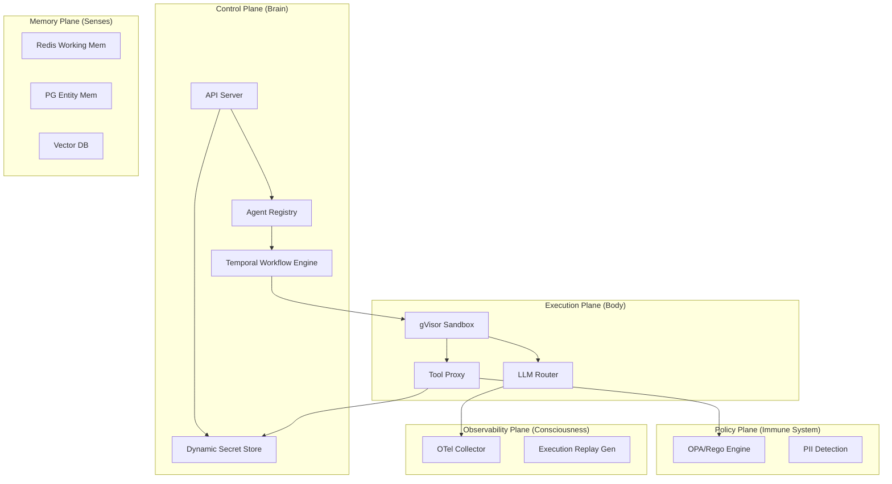

# E-GAOP: Enterprise-Grade Agent Orchestration Platform

> **"The Kubernetes of AI Agents"** — A multi-tenant, zero-trust operating system for autonomous agent execution.

<p align="center">
  
  
  
  
</p>

---

## 🏛️ The Five-Plane Architecture

E-GAOP is designed as a distributed orchestration system, decoupling the management of agent lifecycles from their execution, memory, and policy layers.



---

## 💎 Why E-GAOP?

| Feature | Legacy Agent Frameworks | E-GAOP Platform |
| :--- | :--- | :--- |
| **Isolation** | Single process (Local) | **Kernel-Level (gVisor/Firecracker)** |
| **Durability** | Ephemeral, lost on crash | **Persistent (Temporal Workflows)** |
| **Security** | Shared API Keys | **Dynamic Secret Injection** |
| **Governance** | None / Hardcoded | **OPA-based Runtime Policies** |
| **Observability** | Console logs | **Deterministic Execution Replay** |
| **Scalability** | Laptop-scale | **Kubernetes-native (FAANG level)** |

---

## 🧠 Platform Primitives

E-GAOP treats agents as untrusted workloads with strictly defined resources:

| Primitive | Description | Analogy |
| :--- | :--- | :--- |
| **`AgentSpec`** | The declarative definition of an agent's runtime, LLM, and tools. | `PodSpec` |
| **`ToolGrant`** | Fine-grained RBAC permissions for tool access. | `RoleBinding` |
| **`MemoryScope`** | Namespace-isolated access to Working, Session, or Entity memory. | `PersistentVolume` |
| **`LLMPolicy`** | Routing strategy for cost, quality, and latency optimization. | `Ingress` |
| **`ExecutionRecord`**| A complete trace bundle for deterministic replay. | `AuditLog` |

---

## 🚀 Key Capabilities

-   **Zero-Trust Networking**: Agents have NO direct network access. All tool calls and LLM requests are proxied, validated, and scrubbed.
-   **Multi-Model Resiliency**: Automated fallback chains across OpenAI, Anthropic, and local LLMs.
-   **Differential Memory**: Separation of cold static facts (Entity) from hot, stateful execution context (Working).
-   **Security Hardening**: level-4 encryption for all secrets-at-rest and in-flight.

---

## 🛠️ Infrastructure Stack

- **Orchestration**: Go / gRPC / Protobuf
- **Database**: PostgreSQL (Entity) + Redis (Working) + Qdrant (Semantic)
- **Security**: OPA (Policy) + gVisor (Isolation) + AES-256 (Secrets)
- **Frontend**: Next.js 15 + Tailwind CSS + Lucide React
- **Telemetry**: OpenTelemetry (OTel) + Zipkin

---

## 📁 Repository Layout

```bash
egaop/
├── admin-console/        # Next.js 15 Management Interface
├── api/proto/            # Unified Resource Definitions (gRPC)
├── control-plane/        # API Server, Secret Store, Workflow Engine
├── execution-plane/      # Sandbox Runtime, Tool Proxy, LLM Router
├── memory-plane/         # Federated Memory Management
├── policy-plane/         # Rego Policies & Enforcement
└── observability-plane/  # Telemetry & Execution Replay
```

---

## 🗺️ Engineering Roadmap (FAANG-Grade)

- [x] **v0.1.0**: Core Five-Plane Architecture & gRPC foundation.
- [x] **v0.2.0**: Security Hardening (gVisor enforcement & Dynamic Secrets).
- [ ] **v0.3.0**: Distributed Durability (Full Temporal Integration).
- [ ] **v0.4.0**: Multi-Region Memory Plane (Global Entity Memory).
- [ ] **v1.0.0**: Production Stable Release.

---

Built with precision for the future of **Autonomous Infrastructure**.
