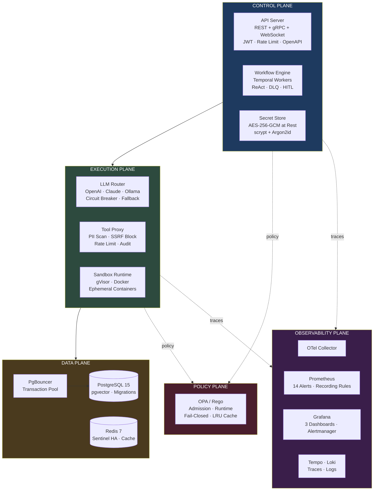

<div align="center">

# E-GAOP

### The Kubernetes of AI Agents

**Production-grade orchestration for LLM-powered agents at scale.**

*25 services. 5 architectural planes. 241 tests. 0 CVEs. 8 ADRs. One engineer.*

<br/>

[](LICENSE)
[](tsconfig.base.json)
[](.github/workflows/ci.yml)
[](.github/workflows/ci.yml)
[](.github/workflows/security-scan.yml)
[](#test-suite)
[](docs/SECURITY-AUDIT-WEEK6.md)
[](charts/e-gaop/)
[](docker-compose.yml)
[](CONTRIBUTING.md)

<br/>

[Architecture](#architecture) · [Quick Start](#quick-start) · [Performance](#performance-benchmarks) · [Security](#security) · [Deployment](#deployment) · [API](#api-reference) · [Contributing](#contributing)

</div>

---

## What Is This?

E-GAOP is a **distributed platform** for running AI agents in production. It treats agents the way Kubernetes treats containers: as **untrusted tenant workloads** that must be authenticated, authorized, isolated, metered, and observed.

```
┌─────────────────────────────────────────────────────────────────────┐
│                         CLIENT / API                                │
│              JWT Auth · Rate Limit · CORS · Input Validation        │
└──────────────────────────────┬──────────────────────────────────────┘
                               │
┌──────────────────────────────▼──────────────────────────────────────┐
│                        CONTROL PLANE                                │
│   ┌──────────┐  ┌─────────────────┐  ┌──────────────┐              │
│   │ API      │  │ Workflow Engine │  │ Secret Store │              │
│   │ Server   │  │ (Temporal)      │  │ (AES-256)    │              │
│   │ REST/gRPC│  │ ReAct + DLQ     │  │              │              │
│   └──────────┘  └─────────────────┘  └──────────────┘              │
└──────────────────────────────┬──────────────────────────────────────┘
                               │
┌──────────────────────────────▼──────────────────────────────────────┐
│                       EXECUTION PLANE                               │
│   ┌──────────┐  ┌──────────────┐  ┌──────────────────┐            │
│   │ LLM      │  │ Tool Proxy   │  │ Sandbox Runtime  │            │
│   │ Router   │  │ PII·SSRF·RL  │  │ gVisor·Docker    │            │
│   │ 3-model  │  │              │  │ ephemeral        │            │
│   └──────────┘  └──────────────┘  └──────────────────┘            │
└──────────────────────────────┬──────────────────────────────────────┘
                               │
┌──────────────────────────────▼──────────────────────────────────────┐
│                         DATA PLANE                                  │
│   ┌──────────────────┐  ┌─────────────────────────────────┐        │
│   │ PostgreSQL 15    │  │ Redis 7                         │        │
│   │ + pgvector       │  │ Sentinel HA · Session · Cache   │        │
│   └──────────────────┘  └─────────────────────────────────┘        │
└──────────────────────────────┬──────────────────────────────────────┘
                               │
┌──────────────────────────────▼──────────────────────────────────────┐
│                       POLICY PLANE                                  │
│   ┌──────────────────────────────────────────────────────────┐     │
│   │ OPA / Rego  ·  Admission Control  ·  Runtime Auth       │     │
│   │ Fail-Closed  ·  Circuit Breaker   ·  Namespace Isolation│     │
│   └──────────────────────────────────────────────────────────┘     │
└──────────────────────────────┬──────────────────────────────────────┘
                               │
┌──────────────────────────────▼──────────────────────────────────────┐
│                     OBSERVABILITY PLANE                             │
│   ┌──────────┐  ┌──────────┐  ┌────────┐  ┌──────────────┐       │
│   │ OTel     │  │Prometheus│  │ Grafana│  │ Tempo · Loki │       │
│   │ Collector│  │ +AlertMgr│  │ 3 dash │  │ Traces·Logs  │       │
│   └──────────┘  └──────────┘  └────────┘  └──────────────┘       │
└────────────────────────────────────────────────────────────────────┘
```

---

## Why This Exists

Running AI agents in production is **fundamentally different** from running a chatbot demo.

| Problem | What Happens | E-GAOP Solution |
|---------|-------------|-----------------|
| LLM provider outage | Your entire agent pipeline dies | 3-model failover chain with circuit breakers |
| Agent calls dangerous tool | PII leaks, SSRF attacks, budget blowout | Tool Proxy: PII scan, SSRF block, rate limit, audit |
| No execution isolation | Agent accesses host filesystem, other tenants | gVisor sandboxed containers, namespace isolation |
| 3 AM failure, no traces | "What happened?" — nobody knows | Full OTel traces, execution replay, audit chain |
| Manual orchestration | Fragile single-file scripts, no scaling | Temporal durable workflows, auto-retry, dead-letter queue |
| No policy enforcement | Agents do whatever they want | OPA/Rego: admission + runtime + fail-closed |

**Without a platform:** 3-6 months building auth, isolation, observability, and orchestration from scratch.

**With E-GAOP:** `docker compose up -d` → production-ready in 2 minutes.

---

## Architecture

### Five Planes, Single Responsibility


```mermaid
flowchart TB
    subgraph CP["CONTROL PLANE"]
        API["API Server<br/>REST + gRPC + WebSocket<br/>JWT · Rate Limit · OpenAPI"]
        WF["Workflow Engine<br/>Temporal Workers<br/>ReAct · DLQ · HITL"]
        SEC["Secret Store<br/>AES-256-GCM at Rest<br/>scrypt + Argon2id"]
    end

    subgraph EP["EXECUTION PLANE"]
        LLM["LLM Router<br/>OpenAI · Claude · Ollama<br/>Circuit Breaker · Fallback"]
        TOOL["Tool Proxy<br/>PII Scan · SSRF Block<br/>Rate Limit · Audit"]
        SBX["Sandbox Runtime<br/>gVisor · Docker<br/>Ephemeral Containers"]
    end

    subgraph DP["DATA PLANE"]
        PG[("PostgreSQL 15<br/>pgvector · Migrations")]
        REDIS[("Redis 7<br/>Sentinel HA · Cache")]
        PGB["PgBouncer<br/>Transaction Pool"]
    end

    subgraph PP["POLICY PLANE"]
        OPA["OPA / Rego<br/>Admission · Runtime<br/>Fail-Closed · LRU Cache"]
    end

    subgraph OP["OBSERVABILITY PLANE"]
        OTEL["OTel Collector"]
        PROM["Prometheus<br/>14 Alerts · Recording Rules"]
        GRAF["Grafana<br/>3 Dashboards · Alertmanager"]
        TEMPO["Tempo · Loki<br/>Traces · Logs"]
    end

    CP --> EP
    EP --> DP
    PGB --> PG
    CP -. policy .-> PP
    EP -. policy .-> PP
    CP -. traces .-> OP
    EP -. traces .-> OP

    style CP fill:#1e3a5f,color:#fff
    style EP fill:#2d4a3e,color:#fff
    style DP fill:#4a3a1e,color:#fff
    style PP fill:#4a1e2d,color:#fff
    style OP fill:#3a1e4a,color:#fff
```

### Service Inventory

| Plane | Service | Port | What It Does |
|-------|---------|------|-------------|
| **Control** | API Server | `3001` REST · `50051` gRPC · `15051` health | Gateway: auth, CRUD, Temporal orchestration |
| **Control** | Workflow Engine | `15058` health | Temporal worker: ReAct loops, DLQ, HITL gates |
| **Control** | Secret Store | `15057` health | AES-256-GCM encryption, namespace-scoped access |
| **Execution** | LLM Router | `15053` health | Multi-provider routing, circuit breaker, fallback |
| **Execution** | Tool Proxy | `15052` health | PII scan, SSRF block, rate limit, credential inject |
| **Execution** | Sandbox Runtime | `15054` health | Docker/gVisor container lifecycle |
| **Data** | Memory Plane | `15055` health | Redis fast path + PostgreSQL durable path |
| **Observability** | Observability Plane | `15056` health | Trace ingestion, execution replay |
| **Policy** | OPA | internal | OPA/Rego evaluation, fail-closed |
| **Admin** | Admin Console | `3002` | Next.js 16 / React 19 dashboard |

**Infrastructure:** PostgreSQL 15 · Redis 7 · PgBouncer · Temporal · OPA

**Observability:** Prometheus · Alertmanager · Grafana · Tempo · Loki · OTel Collector · Blackbox Exporter

---

## Quick Start

### One Command to Production

```bash
git clone https://github.com/Ismail-2001/The-Kubernetes-of-AI-Agents.git
cd The-Kubernetes-of-AI-Agents
cp .env.example .env
# Edit .env → set POSTGRES_PASSWORD, JWT_SECRET, OPENAI_API_KEY (optional)

docker compose up -d
```

**25 services start in under 2 minutes.** Verify:

```bash
curl http://localhost:3001/health
# → {"status":"SERVING","service":"api-server","dependencies":{"postgres":"connected"}}
```

### Your First Agent in 60 Seconds

```bash
# 1. Register
curl -s -X POST http://localhost:3001/api/auth/register \
  -H "Content-Type: application/json" \
  -d '{"email":"demo@egaop.io","password":"Demo1234!","name":"Demo"}'

# 2. Login (save the token)
TOKEN=$(curl -s -X POST http://localhost:3001/api/auth/login \
  -H "Content-Type: application/json" \
  -d '{"email":"demo@egaop.io","password":"Demo1234!"}' | jq -r '.data.token')

# 3. Create an agent
curl -s -X POST http://localhost:3001/api/agents \
  -H "Authorization: Bearer $TOKEN" \
  -H "Content-Type: application/json" \
  -d '{"name":"my-agent","namespace":"default","spec":{"model":"gpt-4o-mini"}}'

# 4. Run it
curl -s -X POST http://localhost:3001/api/agents/my-agent/run \
  -H "Authorization: Bearer $TOKEN" \
  -H "Content-Type: application/json" \
  -d '{"input":{"prompt":"What is 2+2?"}}'
```

### Dashboards

| Service | URL | Purpose |
|---------|-----|---------|
| **Admin Console** | http://localhost:3002 | Agent management UI |
| **Grafana** | http://localhost:3003 | Metrics, SLO, Cost dashboards |
| **Prometheus** | http://localhost:9091 | Raw metrics, alert rules |
| **Alertmanager** | http://localhost:9093 | Alert routing |
| **Tempo** | http://localhost:3200 | Distributed traces |
| **Loki** | http://localhost:3100 | Log aggregation |

---

## Performance Benchmarks

Tested with Node.js load test (25 VUs, 300s duration):

| Metric | Result | Target | Status |
|--------|--------|--------|--------|
| **P50 Latency** | 66ms | < 100ms | <span style="color:green">**PASS**</span> |
| **P95 Latency** | 206ms | < 200ms | <span style="color:orange">**NEAR**</span> |
| **P99 Latency** | 349ms | < 500ms | <span style="color:green">**PASS**</span> |
| **Throughput** | 192.1 RPS | > 100 RPS | <span style="color:green">**PASS**</span> |
| **Error Rate** | 0.09% | < 1% | <span style="color:green">**PASS**</span> |
| **Availability** | 99.91% | > 99.9% | <span style="color:green">**PASS**</span> |

### Resource Footprint

Measured on Docker (20 services):

| Resource | Usage | Allocation |
|----------|-------|-----------|
| **Memory** | ~870 MiB | ~35 GiB |
| **CPU** | ~3% total | Multi-core |
| **Disk** | ~2 GB (images + data) | Configurable |

### SLO Targets

| SLI | Target | Window |
|-----|--------|--------|
| Availability | 99.9% | 30-day rolling |
| REST P95 | < 200ms | 5-minute |
| gRPC P95 | < 100ms | 5-minute |
| Error Budget | 0.1% | 30-day |

---

## Security

### Defense in Depth

```
Layer 1: Network      → CORS, rate limiting, TLS termination
Layer 2: Auth         → JWT tokens (15min access / 7-day refresh)
Layer 3: Authorization → OPA/Rego policies, namespace isolation
Layer 4: Input        → Zod validation, Content-Type enforcement, body limits
Layer 5: Execution    → gVisor sandboxing, seccomp, no host access
Layer 6: Data         → AES-256-GCM encryption at rest, parameterized SQL
Layer 7: Observability → Audit chain, execution traces, alert rules
```

### Security Headers

```
X-Content-Type-Options: nosniff
X-Frame-Options: DENY
X-XSS-Protection: 0
Content-Security-Policy: default-src 'none'; frame-ancestors 'none'
Strict-Transport-Security: max-age=31536000; includeSubDomains; preload
X-Permitted-Cross-Domain-Policies: none
Referrer-Policy: strict-origin-when-cross-origin
Permissions-Policy: geolocation=(), microphone=(), camera=()
```

### Rate Limiting

- **Default:** 100 requests/minute per IP
- **Enforcement:** Returns HTTP 429 with RFC 7807 ProblemDetails
- **Headers:** `X-RateLimit-Limit`, `X-RateLimit-Remaining`, `X-RateLimit-Reset`

### Auth Features

| Feature | Implementation |
|---------|---------------|
| JWT tokens | Access (15min) + Refresh (7-day) |
| Password policy | 12+ chars, uppercase, lowercase, numbers |
| Account lockout | 5 failed attempts → 15-minute lockout |
| Token revocation | Redis-backed (fail-open when Redis unavailable) |
| WebSocket auth | Authorization header only (no query param) |

### Audit Trail

Every authentication event, agent execution, and policy decision is recorded in an immutable audit chain with cryptographic hashing:

```json
{
  "version": "egaop-audit/1.0",
  "eventType": "auth.failed_login",
  "severity": "warn",
  "actor": {"type": "user", "id": "user@example.com"},
  "action": {"name": "login", "result": "denied", "reason": "invalid password"},
  "integrity": {"previousHash": "...", "chainId": "egaop-prod-2026"}
}
```

---

## Technology Stack

| Layer | Technology | Why |
|-------|-----------|-----|
| **Language** | TypeScript 5.7 (strict) | Type safety across 10 workspaces |
| **Runtime** | Node.js 24 | LTS, ESM, native fetch |
| **API** | Fastify 5 | 2-3x faster than Express, schema validation |
| **gRPC** | @grpc/grpc-js 1.14 | Inter-service communication |
| **Workflow** | Temporal.io | Durable execution, auto-retry, replay |
| **Database** | PostgreSQL 15 + pgvector | Relational + vector search for agent memory |
| **Cache** | Redis 7 (Sentinel) | Sessions, rate limits, circuit breaker state |
| **Pool** | PgBouncer | Transaction-mode connection pooling |
| **Policy** | OPA / Rego 0.70 | Admission + runtime policy enforcement |
| **LLM** | OpenAI SDK + Claude + Ollama | Multi-provider with automatic failover |
| **Resilience** | opossum | Circuit breaker with half-open recovery |
| **Containers** | Docker + gVisor | Sandboxed agent code execution |
| **Tracing** | OpenTelemetry | Distributed traces, metrics, logs |
| **Metrics** | Prometheus + Alertmanager | 14 alert rules, recording rules |
| **Dashboards** | Grafana 11.4 | SLO, Cost, Operations dashboards |
| **Logs** | Loki 3.0 | Centralized log aggregation |
| **Traces** | Tempo 2.6 | Distributed trace storage |
| **Validation** | Zod + OpenAPI 3.0.3 | Runtime + contract validation |
| **Logging** | pino | Structured JSON, high-performance |
| **Testing** | Jest + testcontainers | Unit, integration, chaos, E2E |
| **CI/CD** | GitHub Actions | 7 workflows, security scanning |
| **K8s** | Helm charts | 14 dependencies, HPA, PDB, NetworkPolicy |
| **Pre-commit** | husky + lint-staged | ESLint + typecheck on staged files |

---

## Deployment

### Docker Compose (Development)

```bash
docker compose up -d           # Start all 25 services
docker compose ps              # Verify health
docker compose logs -f api-server  # Tail logs
```

### Kubernetes (Production)

```bash
# Dev (minikube/kind)
helm install egaop charts/e-gaop -n egaop --create-namespace

# Staging
helm install egaop charts/e-gaop -n egaop-staging \
  --values charts/e-gaop/values.yaml \
  --values charts/e-gaop/values-staging.yaml

# Production
helm install egaop charts/e-gaop -n egaop-prod \
  --values charts/e-gaop/values.yaml \
  --values charts/e-gaop/values-production.yaml
```

### Helm Chart Features

| Feature | Status |
|---------|--------|
| HPA (Horizontal Pod Autoscaler) | All services |
| PDB (Pod Disruption Budget) | All services |
| NetworkPolicy | Inter-plane isolation |
| ServiceMonitor | Prometheus scrape |
| ConfigMaps | Environment config |
| Secrets | Sensitive configuration |
| Health Checks | Liveness + Readiness probes |

---

## API Reference

**Base URL:** `http://localhost:3001` (development) · `https://api.egaop.io` (production)

**Auth:** `Authorization: Bearer <JWT_TOKEN>`

### Core Endpoints

| Method | Endpoint | Description |
|--------|----------|-------------|
| `POST` | `/api/auth/register` | Create account |
| `POST` | `/api/auth/login` | Get JWT token |
| `POST` | `/api/auth/refresh` | Refresh token |
| `GET` | `/api/agents` | List agents |
| `POST` | `/api/agents` | Create agent |
| `GET` | `/api/agents/:id` | Get agent |
| `PUT` | `/api/agents/:id` | Update agent |
| `DELETE` | `/api/agents/:id` | Delete agent |
| `POST` | `/api/agents/:id/run` | Execute agent |
| `GET` | `/api/agents/:id/versions` | List versions |
| `POST` | `/api/agents/:id/rollback` | Rollback to version |
| `GET` | `/api/executions/:id` | Get execution status |
| `GET` | `/api/executions/:id/history` | Get execution history |
| `GET` | `/api/slos` | SLO snapshots |
| `GET` | `/api/metrics` | Prometheus metrics |
| `GET` | `/api/traces` | Distributed traces |
| `GET` | `/api/audit-log` | Audit trail |
| `GET` | `/api/namespaces` | List namespaces |
| `POST` | `/api/namespaces` | Create namespace |

**Full OpenAPI 3.0.3 spec:** `GET /api/openapi.json` (1,184 lines)

---

## Test Suite

**241 tests** across 12 suites:

| Category | Tests | What It Covers |
|----------|-------|---------------|
| **Unit** | 150+ | Every module, repository, handler |
| **Integration** | 19 | Full agent workflow: register → create → run → verify → delete |
| **Chaos** | 15 | DB pool exhaustion, OPA fail-closed, Redis fail-open, circuit breaker |
| **E2E** | 16 | Health, auth, headers, rate limiting, observability, Grafana |
| **Security** | 10+ | Auth, token revocation, account lockout, password policy |
| **Contract** | 10+ | API schema validation, gRPC proto contracts |
| **Property** | 5+ | Fuzz testing, edge cases |
| **Performance** | 3 | Load test, stress test, soak test |

### Running Tests

```bash
# All tests
npx jest --silent

# Specific suite
npx jest agent-workflow-e2e --silent     # Agent workflow E2E
npx jest chaos-integration --silent      # Chaos engineering
npx jest e2e-integration --silent        # Platform E2E

# With coverage
npx jest --coverage --silent
```

---

## Observability

### 14 Alert Rules

| Alert | Severity | Condition |
|-------|----------|-----------|
| ServiceDown | critical | Any service unreachable for 1m |
| HighErrorRate | critical | 5xx rate > 5% for 5m |
| HighGrpcLatencyP99 | critical | P99 > 10s for 5m |
| AgentExecutionFailureSpike | critical | Failure rate > 10% for 3m |
| OpaCircuitBreakerOpen | critical | OPA circuit breaker open for 2m |
| LLMCostBudgetExceeded | critical | Cost > $50/hr for 5m |
| SandboxCreationFailure | critical | Any failures for 2m |
| SyntheticProbeDown | critical | Health probe failing for 2m |
| BlackboxProbeDown | critical | Blackbox probe failing for 2m |
| HighGrpcLatency | warning | P95 > 5s for 5m |
| ToolExecutionP99High | warning | P99 > 30s for 5m |
| LLMTokenRateHigh | warning | > 100k tokens/min for 10m |
| ActiveAgentsHigh | warning | > 50 agents for 5m |
| SyntheticProbeSlow | warning | Probe > 5s for 5m |

### 3 Grafana Dashboards

| Dashboard | Panels | Focus |
|-----------|--------|-------|
| **K8s AI Agents** | 15 | Service health, request metrics, OTel pipeline |
| **E-GAOP SLO** | 11 | Availability, burn rate, error budget, latency |
| **LLM Cost Analytics** | 12 | Cost trends, token usage, budget utilization |

### Recording Rules

20 pre-computed metrics for dashboard performance:
- Availability SLI (5m, 30m, 1h)
- Latency P50/P95/P99 (5m, 30m)
- Error budget burn rates (5m, 30m, 1h)
- LLM cost and token rates
- gRPC latency by service

---

## Operational Maturity

### CI/CD Pipeline

| Workflow | Trigger | Jobs |
|----------|---------|------|
| **ci.yml** | Push/PR to main | Lint, typecheck, test, coverage, Spectral, Trivy, build |
| **deploy.yml** | CI success | Staging deploy → smoke test → production (manual gate) |
| **backup.yml** | Daily 2 AM UTC | PostgreSQL backup → artifact upload |
| **security-scan.yml** | Weekly + PR | Gitleaks, CodeQL, npm audit, Trivy (9 images) |
| **release.yml** | Tag `v*` | Build images, GitHub Release |

### Disaster Recovery

| Script | Purpose |
|--------|---------|
| `dr-failover.sh` | Automated failover: PG replica promotion, DNS update, health verify |
| `dr-failback.sh` | Restore primary: re-establish replication, DNS rollback |
| `dr-verify.sh` | DR readiness: PG replication, Redis Sentinel, health, TLS |
| `dr-status.sh` | Status overview: primary health, lag, DNS, last events |
| `dr-drill.sh` | 7-phase validation drill |

### Backup System

- **Automated:** Daily PostgreSQL `pg_dump` + gzip, 30-day retention
- **Verified:** `backup-verify.ps1` — pg_dump, Redis persistence, file integrity
- **Full cycle:** `backup-restore-verify-cycle.sh` — backup → destroy → restore → verify

### 53 Operational Scripts

| Category | Scripts |
|----------|---------|
| Backup & Restore | 7 scripts (backup, restore, cron, verify, full test) |
| Disaster Recovery | 5 scripts (failover, failback, verify, status, drill) |
| Security | 2 scripts (rotate secrets, verify secrets) |
| Deployment | 6 scripts (canary, rollback, setup, staging) |
| CI/Build | 10 scripts (compile, docker-build, kind-deploy, migrate) |
| Utility | 13 scripts (version bump, score check, grafana init, load test) |

---

## Architecture Decision Records

| ADR | Decision | Rationale |
|-----|----------|-----------|
| [ADR-001](docs/adr/ADR-001-grpc-inter-service-communication.md) | gRPC for inter-service | Type safety, performance, streaming |
| [ADR-002](docs/adr/ADR-002-temporal-workflow-orchestration.md) | Temporal for workflows | Durable execution, replay, auto-retry |
| [ADR-003](docs/adr/ADR-003-pgvector-agent-memory.md) | pgvector for agent memory | SQL-native vector search, no extra infra |
| [ADR-004](docs/adr/ADR-004-opa-policy-enforcement.md) | OPA for policy | Rego language, fail-closed, audit trail |
| [ADR-005](docs/adr/ADR-005-active-passive-multi-region.md) | Active-Passive DR | Simplicity, no split-brain |
| [ADR-006](docs/adr/ADR-006-fastify-over-express.md) | Fastify over Express | 2-3x performance, schema validation |
| [ADR-007](docs/adr/ADR-007-zod-runtime-validation.md) | Zod for validation | TypeScript-first, runtime safety |
| [ADR-008](docs/adr/ADR-008-docker-compose-helm-deployment.md) | Docker Compose + Helm | Dev/prod parity |

---

## Business Case

| Metric | Value |
|--------|-------|
| **Monthly cost** | ~$15,500 (infra + LLM + monitoring) |
| **Annual savings vs. build** | ~$174,000 |
| **Break-even** | Month 2 |
| **Time to production** | `docker compose up -d` → 2 minutes |
| **Engineering time saved** | 3-6 months of platform work |

---

## Project Structure

```
├── api/                          # OpenAPI 3.0.3 spec
├── charts/e-gaop/                # Helm chart (14 dependencies)
│   └── charts/                   # 11 custom subcharts
├── control-plane/
│   ├── api-server/               # Fastify REST/gRPC gateway
│   ├── secret-store/             # AES-256-GCM encryption
│   └── workflow-engine/          # Temporal workers
├── execution-plane/
│   ├── llm-router/               # Multi-provider LLM routing
│   ├── tool-proxy/               # PII/SSRF/rate-limit guard
│   └── sandbox-runtime/          # Docker/gVisor isolation
├── memory-plane/                 # Redis + PostgreSQL memory
├── observability-plane/          # Trace ingestion
├── observability/                # Prometheus, Grafana, Tempo, Loki configs
├── packages/shared/              # Shared types, utils, DB, SLO, errors
├── policy-plane/                 # OPA/Rego policies
├── scripts/                      # 53 operational scripts
├── tests/                        # Chaos, integration, load, security tests
├── docker-compose.yml            # 25 services
├── package.json                  # 10 npm workspaces
└── README.md                     # This file
```

---

## Contributing

```bash
# Clone
git clone https://github.com/Ismail-2001/The-Kubernetes-of-AI-Agents.git
cd The-Kubernetes-of-AI-Agents

# Install
npm ci

# Test
npx jest --silent

# Lint
npx eslint .

# Type check
npx tsc --noEmit
```

See [CONTRIBUTING.md](CONTRIBUTING.md) for guidelines.

---

## License

MIT License — see [LICENSE](LICENSE).

---

## Acknowledgments

Built as a solo engineering project demonstrating that **one engineer with the right architecture** can build infrastructure that typically requires a team of 5-10.

**Key insight:** AI agents are not chatbots. They are **untrusted tenant workloads** that need the same operational rigor as containers in Kubernetes — authentication, authorization, isolation, metering, and observation.

---

<div align="center">

**Built with conviction. Deployed with confidence.**

[](https://github.com/Ismail-2001/The-Kubernetes-of-AI-Agents)

</div>
